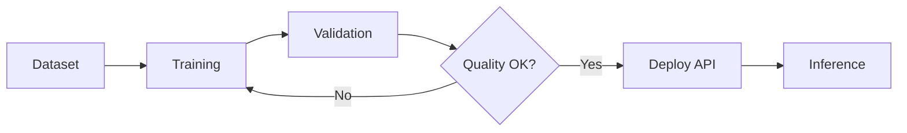

# End-to-End Workflow

## Overview

Complete workflow from dataset preparation to production deployment.



## 1. Prepare Dataset

```bash
# Analyze and validate existing data
python analyze_dataset.py --input training_ready/

# Prepare training splits
python prepare_training_data.py \
    --input raw_images/ \
    --output training_ready/
```

Expected structure:
```
training_ready/
├── train/
│   ├── images/
│   ├── masks/
│   └── metadata.json
└── validation/
    ├── images/
    ├── masks/
    └── metadata.json
```

## 2. Train LoRA (First Time)

```bash
# Dry run to verify setup
python train_lora_inpainting.py --dry-run

# Quick test (100 steps)
python train_lora_inpainting.py --max-steps 100 --subset 100

# Full training
accelerate launch --mixed_precision=fp16 \
    train_lora_inpainting.py \
    --config configs/lora_training.yaml
```

Monitor with TensorBoard:
```bash
tensorboard --logdir lora_checkpoints/logs
```

## 3. Test Inference

```bash
# Test with CLI
python main.py --source test_room.jpg \
    --color "200,180,160" \
    --lora lora_checkpoints \
    --output test_result.png

# Compare with base model
python main.py --source test_room.jpg \
    --color "200,180,160" \
    --output test_base.png
```

## 4. Resume Training (if needed)

```bash
# Resume from checkpoint
python train_lora_inpainting.py \
    --resume lora_checkpoints/checkpoint-2000 \
    --max-steps 5000
```

## 5. Deploy Backend API

```bash
# Start server
uvicorn api:app --host 0.0.0.0 --port 8000

# Verify LoRA loaded
curl http://localhost:8000/health

# Test endpoint
curl -X POST "http://localhost:8000/process-color" \
    -F "source=@room.jpg" \
    -F "color=200,180,160" \
    -o result.png
```

## 6. Production Config

```python
# config.py
config.lora.enabled = True
config.lora.default_path = "lora_checkpoints"
config.lora.default_scale = 0.8  # Slightly reduced for stability
```

## Quick Reference

| Task | Command |
|------|---------|
| Dry run | `python train_lora_inpainting.py --dry-run` |
| Quick test | `python train_lora_inpainting.py --max-steps 100` |
| Full train | `accelerate launch train_lora_inpainting.py` |
| Resume | `python train_lora_inpainting.py --resume checkpoint-N` |
| Inference | `python main.py --source img.jpg --lora lora_checkpoints` |
| Start API | `uvicorn api:app --port 8000` |

## File Checklist

After complete setup, you should have:

- [x] `training_ready/train/` - Training data
- [x] `training_ready/validation/` - Validation data
- [x] `configs/lora_training.yaml` - Training config
- [x] `lora_checkpoints/adapter_model.safetensors` - Trained weights
- [x] `lora_checkpoints/adapter_config.json` - LoRA config
- [x] `lora_checkpoints/training_state.json` - Training status
