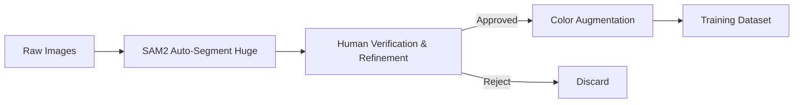

# High-Quality Wall Inpainting Pipeline Workflow

Tài liệu này trình bày quy trình xây dựng dataset, training và validation tối ưu chất lượng (Quality > Quantity).

## 1. Chiến lược cốt lõi: Human-in-the-Loop Hybrid Pipeline

Để đạt chất lượng mask tốt nhất, chúng ta không thể chỉ dựa vào Auto-Segmentation. Chiến lược chấp nhận đánh đổi số lượng lấy chất lượng sẽ theo mô hình:



**Nguyên tắc:** "Thà có 100 sample hoàn hảo còn hơn 1000 sample nhiễu."

---

## 2. Quy trình chi tiết

### Phase 1: High-Efficiency Segmentation

**Yêu cầu kỹ thuật:**
- **Model:** FastSAM / WallSegmenter (Lightweight, không cần download 1.3GB model).
- **Strategy:** Tạo mask nháp nhanh chóng, chấp nhận sai sót nhỏ để con người sửa (Human-in-the-Loop).

**Bước 1: Auto-Proposal**
Chạy script để generate mask nháp (siêu nhanh):
```bash
python prepare_dataset_v2.py ^
    --input "D:\học\Tài Liệu CNTT\wall_inpainting\dataset\training_ready\train" ^
    --output dataset/training_v2 ^
    --proposal-only ^
    --include-ceiling
```

**Bước 2: Interactive Refinement (Critical)**
Sử dụng tool lọc và chỉnh sửa:
```bash
python tools/mask_editor.py \
    --masks dataset/training_v2/proposals/masks \
    --images dataset/training_v2/proposals/images
```

*Tip:* Dùng phím `Space` để Next, `R` để Reject (xóa mask xấu), `[ ]` chỉnh brush size.

### Phase 2: Data Augmentation & Formatting

Sau khi duyệt xong mask (các mask xấu đã xóa, sai đã sửa), chạy script lần nữa để tạo dataset Augmented:

```bash
python prepare_dataset_v2.py ^
    --input "D:\học\Tài Liệu CNTT\wall_inpainting\dataset\training_ready\train" ^
    --output dataset/training_v2 ^
    --colors-per-image 10 ^
    --include-ceiling
```
*(Script sẽ tự động dùng mask đã chỉnh sửa nếu tìm thấy trong thư mục masks)*

**Logic Augmentation (Unlimited Colors):**
- **Saturation Control:** Giới hạn Saturation < 85%.
- **Lighting Preservation (LAB):** Giữ nguyên kênh Lightness.
- **Ratio:** 1 ảnh gốc -> 10 biến thể màu.

### Phase 3: Integration vào Training Loop

**Dataset Configuration:**
```python
# config/dataset_config.toml
[[dataset]]
enable_bucket = true
resolution = 512
keep_tokens = 1
  [[dataset.subset]]
  image_dir = "dataset/training_v2/train/images"
  mask_dir = "dataset/training_v2/train/masks"
  caption_extension = ".jsonl"
```

---

## 3. Implementation Steps Update

1.  **Reverted to FastSAM:** Đã loại bỏ requirement cài đặt SAM2 phức tạp.
2.  **Optimized Workflow:** Đã tách riêng bước Proposal và Augmentation để tối ưu thời gian review.

---

## 3.1 Troubleshooting

| Issue         | Solution                                                                                             |
| :------------ | :--------------------------------------------------------------------------------------------------- |
| **Masks Empty/Bad** | Chạy với `--include-ceiling` để cải thiện vùng nhận diện. Hoặc vẽ tay bằng `mask_editor.py`.        |
| **Install Error** | Nếu thiếu `transformers`: `pip install transformers`. Không cần cài `segment-anything-2` nữa. |

---

## 4. Tóm tắt Action Plan

1.  **Chạy Proposal Phase:** `python prepare_dataset_v2.py ... --proposal-only`
2.  **Manual Clean:** `python tools/mask_editor.py ...`
3.  **Final Generation:** `python prepare_dataset_v2.py ... --colors-per-image 10`
