# Pipeline Architecture: Complete Data Flow

> **Version:** 1.0.0  
> **Last Updated:** 2026-02-05  
> **Purpose:** Comprehensive visualization of Training, Validation, and Inference pipelines with exact tensor shapes

---

## 1. Training Pipeline (LoRA Fine-tuning)

```mermaid
flowchart TB
    subgraph DATASET["📁 WallInpaintingDataset"]
        direction TB
        D1["📷 Load Image<br/>[H, W, 3] PIL RGB"]
        D2["🎭 Load Mask<br/>[H, W] PIL L"]
        D3{"mask_erosion_size > 0?"}
        D4["cv2.erode(mask, kernel)<br/>kernel=[5,5]"]
        D5{"random < random_color_prob?"}
        D6["🎨 generate_random_color()<br/>RGB (30, 240) random"]
        D7["🎨 extract_dominant_color()<br/>median/mean/kmeans"]
        D8["apply_color_jitter()<br/>LAB space ±15"]
        D9["🖼️ create_solid_color_reference()<br/>[512, 512, 3] + noise + gradient"]
        D10["📦 transforms.Compose"]
        
        D1 --> D3
        D2 --> D3
        D3 -->|Yes| D4
        D3 -->|No| D5
        D4 --> D5
        D5 -->|Yes 30%| D6
        D5 -->|No 70%| D7
        D7 --> D8
        D6 --> D9
        D8 --> D9
        D9 --> D10
    end
    
    subgraph OUTPUT_DATASET["📤 Dataset Output (per sample)"]
        direction LR
        O1["pixel_values<br/>[3, 512, 512]<br/>float32 [-1, 1]"]
        O2["mask<br/>[1, 512, 512]<br/>float32 [0, 1]"]
        O3["reference_image<br/>[3, 224, 224]<br/>float32 [-1, 1]"]
        O4["dominant_color<br/>[3]<br/>uint8 [0, 255]"]
    end
    
    D10 --> O1
    D10 --> O2
    D10 --> O3
    D10 --> O4
    
    subgraph COLLATOR["📦 collate_fn (batch=4)"]
        direction LR
        C1["pixel_values<br/>[4, 3, 512, 512]"]
        C2["masks<br/>[4, 1, 512, 512]"]
        C3["reference_images<br/>[4, 3, 224, 224]"]
        C4["input_ids<br/>[4, 77]"]
    end
    
    OUTPUT_DATASET --> COLLATOR
    
    subgraph VAE_ENCODE["🔷 VAE Encoder (frozen)"]
        direction TB
        V1["batch['pixel_values']<br/>[4, 3, 512, 512]"]
        V2["vae.encode().latent_dist.sample()<br/>compression 8x"]
        V3["latents × 0.18215<br/>[4, 4, 64, 64]"]
        
        V4["masked_image = pixel_values × (1 - mask)<br/>[4, 3, 512, 512]"]
        V5["vae.encode(masked_image)<br/>[4, 4, 64, 64]"]
        V6["masked_image_latents × 0.18215<br/>[4, 4, 64, 64]"]
        
        V7["F.interpolate(mask)<br/>mode='nearest'"]
        V8["mask_latent<br/>[4, 1, 64, 64]"]
        
        V1 --> V2 --> V3
        V1 --> V4 --> V5 --> V6
        V4 -.->|"mask"| V7 --> V8
    end
    
    COLLATOR --> VAE_ENCODE
    
    subgraph NOISE_SAMPLING["🎲 Noise Sampling"]
        direction TB
        N1["noise = torch.randn_like(latents)<br/>[4, 4, 64, 64]<br/>ε ~ N(0, I)"]
        N2["timesteps = randint(0, 1000)<br/>[4]"]
        N3["noisy_latents = scheduler.add_noise()<br/>z_t = √α_t × z_0 + √(1-α_t) × ε<br/>[4, 4, 64, 64]"]
    end
    
    V3 --> N1
    V3 --> N3
    N1 --> N3
    N2 --> N3
    
    subgraph UNET_INPUT["🔗 UNet Input Construction"]
        direction TB
        U1["torch.cat([noisy_latents, mask, masked_image_latents], dim=1)"]
        U2["latent_model_input<br/>[4, 9, 64, 64]<br/>channels: 4 + 1 + 4 = 9"]
    end
    
    N3 --> U1
    V8 --> U1
    V6 --> U1
    U1 --> U2
    
    subgraph TEXT_ENCODER["📝 Text Encoder (frozen)"]
        direction TB
        T1{"unconditional_training?"}
        T2["tokenizer([''])<br/>empty string"]
        T3["text_encoder(empty)<br/>[1, 77, 768]"]
        T4["expand(batch_size)<br/>[4, 77, 768]"]
        T5["tokenizer(captions)<br/>[4, 77]"]
        T6["text_encoder(input_ids)<br/>[4, 77, 768]"]
        
        T1 -->|"True (Zero-Prompt)"| T2 --> T3 --> T4
        T1 -->|"False"| T5 --> T6
    end
    
    COLLATOR --> TEXT_ENCODER
    
    subgraph UNET["🧠 UNet2DConditionModel + LoRA"]
        direction TB
        UN1["Input: latent_model_input<br/>[4, 9, 64, 64]"]
        UN2["Timesteps: t<br/>[4]"]
        UN3["encoder_hidden_states<br/>[4, 77, 768]"]
        UN4["UNet Forward Pass<br/>Attention + LoRA adapters"]
        UN5["noise_pred<br/>[4, 4, 64, 64]"]
        
        UN1 --> UN4
        UN2 --> UN4
        UN3 --> UN4
        UN4 --> UN5
    end
    
    U2 --> UNET
    N2 --> UNET
    TEXT_ENCODER --> UNET
    
    subgraph LOSS["📉 Loss Computation"]
        direction TB
        L1["noise (GT)<br/>[4, 4, 64, 64]"]
        L2["noise_pred<br/>[4, 4, 64, 64]"]
        L3["loss = F.mse_loss(noise_pred, noise)<br/>scalar"]
        L4["accelerator.backward(loss)"]
        L5["optimizer.step()<br/>lr_scheduler.step()"]
        
        L1 --> L3
        L2 --> L3
        L3 --> L4 --> L5
    end
    
    N1 --> LOSS
    UNET --> LOSS
    
    style DATASET fill:#e1f5fe
    style VAE_ENCODE fill:#f3e5f5
    style UNET fill:#fff3e0
    style LOSS fill:#ffebee
```

---

## 2. Validation Pipeline

```mermaid
flowchart TB
    subgraph VAL_DATASET["📁 Validation Dataset"]
        VD1["WallInpaintingDataset<br/>split='validation'<br/>max_samples=50"]
        VD2["sample_data = dataset[i]"]
    end
    
    subgraph CONVERT["🔄 Tensor to PIL Conversion"]
        CV1["tensor_to_pil(pixel_values)<br/>[3,512,512] → PIL RGB"]
        CV2["mask_tensor_to_pil(mask)<br/>[1,512,512] → PIL L"]
        CV3["dominant_color_to_pil(color)<br/>[3] → PIL RGB [512,512]"]
    end
    
    VD2 --> CV1
    VD2 --> CV2
    VD2 --> CV3
    
    subgraph INFERENCE["🎨 Inference Pipeline"]
        direction TB
        I1["StableDiffusionInpaintPipeline"]
        I2["prompt = '' (Zero-Prompt)"]
        I3["image = source_image<br/>PIL RGB"]
        I4["mask_image<br/>PIL L"]
        I5["num_inference_steps = 20"]
        I6["generator.manual_seed(42)"]
        I7["pipeline(...).images[0]<br/>PIL RGB [512, 512]"]
        
        I1 --> I2
        I2 --> I7
        I3 --> I7
        I4 --> I7
        I5 --> I7
        I6 --> I7
    end
    
    CV1 --> INFERENCE
    CV2 --> INFERENCE
    
    subgraph METRICS["📊 Color Fidelity Metrics"]
        direction TB
        M1["reference_image (solid color)<br/>PIL RGB"]
        M2["model_output<br/>PIL RGB"]
        M3["mask_image<br/>PIL L"]
        M4["compute_color_fidelity_metrics()"]
        M5["Extract masked region pixels"]
        M6["Convert to LAB/HSV"]
        M7["Metrics:<br/>• lab_distance<br/>• delta_e_76<br/>• hue_error<br/>• lightness_diff<br/>• chroma_diff"]
        
        M1 --> M4
        M2 --> M4
        M3 --> M4
        M4 --> M5 --> M6 --> M7
    end
    
    CV3 --> METRICS
    INFERENCE --> METRICS
    CV2 --> METRICS
    
    subgraph VISUALIZER["🖼️ ValidationVisualizer"]
        direction TB
        VS1["create_segment_overlay()<br/>source + mask overlay"]
        VS2["ValidationSample dataclass"]
        VS3["create_grid()<br/>6-column layout"]
        VS4["save_metrics()<br/>JSON file"]
        
        VS1 --> VS2
        METRICS --> VS2
        VS2 --> VS3
        VS2 --> VS4
    end
    
    subgraph GRID_OUTPUT["📊 Validation Grid Output"]
        direction LR
        G1["Source<br/>512×512"]
        G2["Reference<br/>(solid color)<br/>512×512"]
        G3["Mask<br/>512×512"]
        G4["Segment<br/>Overlay<br/>512×512"]
        G5["Depth<br/>(N/A)<br/>512×512"]
        G6["Output<br/>512×512"]
    end
    
    VS3 --> GRID_OUTPUT
    
    style VAL_DATASET fill:#e8f5e9
    style INFERENCE fill:#fff3e0
    style METRICS fill:#fce4ec
    style GRID_OUTPUT fill:#e3f2fd
```

---

## 3. Inference Pipeline (Production)

```mermaid
flowchart TB
    subgraph INPUTS["📥 User Inputs"]
        direction LR
        IN1["source_image<br/>PIL RGB [any size]"]
        IN2["mask_image<br/>PIL L [any size]"]
        IN3["reference_image<br/>PIL RGB [any size]<br/>(solid color or texture)"]
    end
    
    subgraph PREPROCESS["🔧 Preprocessing"]
        direction TB
        P1["Store original_size<br/>(W, H)"]
        P2["source.resize(512, 512)<br/>LANCZOS"]
        P3["mask.resize(512, 512)<br/>NEAREST"]
        P4["reference.resize(224, 224)<br/>LANCZOS for IP-Adapter"]
    end
    
    INPUTS --> PREPROCESS
    
    subgraph DEPTH_EST["🔍 Depth Estimation"]
        direction TB
        DE1["Intel DPT-Large<br/>transformers.pipeline"]
        DE2["depth_estimator(source)<br/>returns {'depth': Image}"]
        DE3["depth_map.resize(512, 512)<br/>PIL L grayscale"]
    end
    
    P2 --> DEPTH_EST
    
    subgraph PIPELINE_SETUP["⚙️ Pipeline Configuration"]
        direction TB
        PS1["StableDiffusionControlNetInpaintPipeline"]
        PS2["ControlNet (depth)<br/>lllyasviel/control_v11f1p_sd15_depth"]
        PS3["IP-Adapter Plus<br/>ip-adapter-plus_sd15.bin"]
        PS4["LoRA weights (optional)<br/>wall_inpainting adapter"]
        PS5["pipe.set_ip_adapter_scale(ip_adapter_scale)"]
    end
    
    subgraph GENERATION["🎨 Diffusion Generation"]
        direction TB
        G1["pipe(<br/>  prompt='',<br/>  negative_prompt='blurry...',<br/>  image=source_resized,<br/>  mask_image=mask_resized,<br/>  control_image=depth_map,<br/>  ip_adapter_image=reference_224,<br/>  num_inference_steps=30,<br/>  controlnet_conditioning_scale=0.8,<br/>  ip_adapter_scale=1.0,<br/>  strength=0.99,<br/>  guidance_scale=5.0<br/>)"]
    end
    
    P2 --> G1
    P3 --> G1
    P4 --> G1
    DEPTH_EST --> G1
    PS5 --> G1
    
    subgraph DENOISING["🔄 Denoising Loop (T=30 steps)"]
        direction TB
        DN1["t=T: Start from noisy latent<br/>[1, 4, 64, 64]"]
        DN2["For t in T → 0:"]
        DN3["1. Encode control (depth)<br/>[1, 320, 64, 64]..."]
        DN4["2. Concat UNet input<br/>[1, 9, 64, 64]"]
        DN5["3. IP-Adapter injects reference features<br/>Cross-attention modification"]
        DN6["4. UNet predicts noise ε̂"]
        DN7["5. scheduler.step(ε̂, t, z_t)<br/>z_{t-1} = denoise(z_t)"]
        DN8["Output: z_0<br/>[1, 4, 64, 64]"]
        
        DN1 --> DN2 --> DN3 --> DN4 --> DN5 --> DN6 --> DN7
        DN7 -->|"repeat"| DN2
        DN7 -->|"t=0"| DN8
    end
    
    G1 --> DENOISING
    
    subgraph VAE_DECODE["🔷 VAE Decoder"]
        direction TB
        VD1["z_0 / 0.18215<br/>[1, 4, 64, 64]"]
        VD2["vae.decode(z_0)"]
        VD3["output_image<br/>[1, 3, 512, 512]"]
        VD4["Convert to PIL<br/>512×512 RGB"]
    end
    
    DENOISING --> VAE_DECODE
    
    subgraph POSTPROCESS["📤 Postprocessing"]
        direction TB
        PP1["result.resize(original_size)<br/>LANCZOS"]
        PP2["Return final image<br/>PIL RGB [original size]"]
    end
    
    VAE_DECODE --> POSTPROCESS
    P1 --> POSTPROCESS
    
    style INPUTS fill:#e8f5e9
    style DEPTH_EST fill:#e3f2fd
    style DENOISING fill:#fff3e0
    style VAE_DECODE fill:#f3e5f5
    style POSTPROCESS fill:#e8f5e9
```

---

## 4. IP-Adapter Feature Injection (Detail)

```mermaid
flowchart LR
    subgraph CLIP["🖼️ CLIP Image Encoder"]
        direction TB
        C1["reference_image<br/>[1, 3, 224, 224]"]
        C2["CLIP ViT-H/14"]
        C3["image_embeds<br/>[1, 257, 1024]<br/>(256 patches + 1 CLS)"]
        C4["image_proj<br/>(IP-Adapter projector)"]
        C5["projected_embeds<br/>[1, 4, 768]"]
        
        C1 --> C2 --> C3 --> C4 --> C5
    end
    
    subgraph CROSS_ATTN["🔀 Cross-Attention Modification"]
        direction TB
        A1["Original: Q × K^T (text)<br/>K = text_embeds [1, 77, 768]"]
        A2["IP-Adapter adds:<br/>Q × K_ip^T (image)<br/>K_ip = projected_embeds [1, 4, 768]"]
        A3["Combined attention:<br/>Attn = softmax(Q×K^T) × V<br/>     + scale × softmax(Q×K_ip^T) × V_ip"]
        
        A1 --> A3
        A2 --> A3
    end
    
    C5 --> A2
    
    subgraph EFFECT["💡 Effect on Generation"]
        direction TB
        E1["scale=0.0: Text only"]
        E2["scale=0.5: Balanced"]
        E3["scale=1.0: Image dominant"]
        E4["For color transfer:<br/>Use scale=1.0 + empty prompt"]
    end
    
    A3 --> EFFECT
    
    style CLIP fill:#e3f2fd
    style CROSS_ATTN fill:#fff3e0
    style EFFECT fill:#e8f5e9
```

---

## 5. Complete Shape Summary Table

| Stage | Tensor | Shape | dtype | Range |
|-------|--------|-------|-------|-------|
| **Dataset** | pixel_values | [3, 512, 512] | float32 | [-1, 1] |
| | mask | [1, 512, 512] | float32 | [0, 1] |
| | reference_image | [3, 224, 224] | float32 | [-1, 1] |
| | dominant_color | [3] | uint8 | [0, 255] |
| **Batch** | pixel_values | [B, 3, 512, 512] | float16 | [-1, 1] |
| | masks | [B, 1, 512, 512] | float16 | [0, 1] |
| | reference_images | [B, 3, 224, 224] | float16 | [-1, 1] |
| | input_ids | [B, 77] | int64 | [0, vocab] |
| **VAE Latent** | latents | [B, 4, 64, 64] | float16 | ≈[-4, 4] |
| | masked_image_latents | [B, 4, 64, 64] | float16 | ≈[-4, 4] |
| | mask_downsampled | [B, 1, 64, 64] | float16 | [0, 1] |
| **UNet Input** | latent_model_input | [B, 9, 64, 64] | float16 | varies |
| **Text Encoder** | encoder_hidden_states | [B, 77, 768] | float16 | normalized |
| **UNet Output** | noise_pred | [B, 4, 64, 64] | float16 | ≈N(0,1) |
| **Noise (GT)** | noise | [B, 4, 64, 64] | float32 | N(0, 1) |
| **Loss** | mse_loss | scalar | float32 | ≥0 |
| **IP-Adapter** | image_embeds | [B, 257, 1024] | float16 | normalized |
| | projected_embeds | [B, 4, 768] | float16 | normalized |
| **ControlNet** | depth_features | list of [B, C, H, W] | float16 | varies |

---

## 6. Key Observations

### 🚨 Training vs Inference Gap

> **Critical**: LoRA learns to denoise towards original image, but inference expects it to use IP-Adapter features for color. This is the fundamental architectural limitation.
